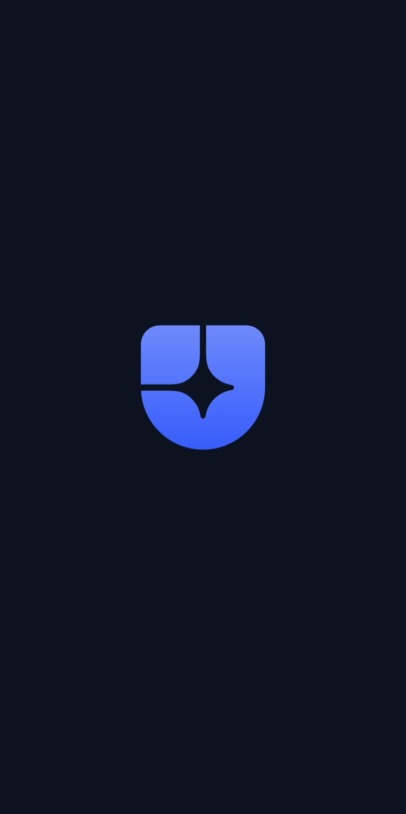
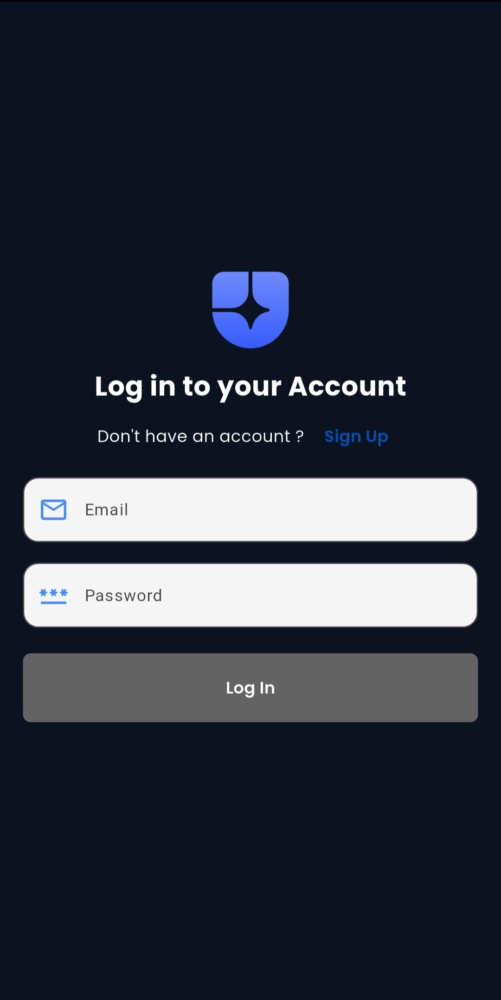
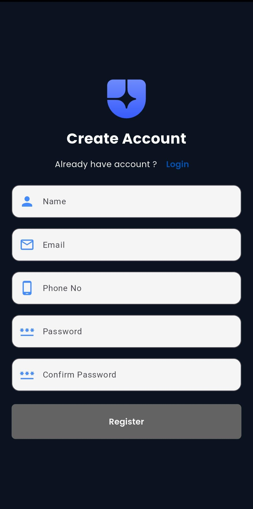
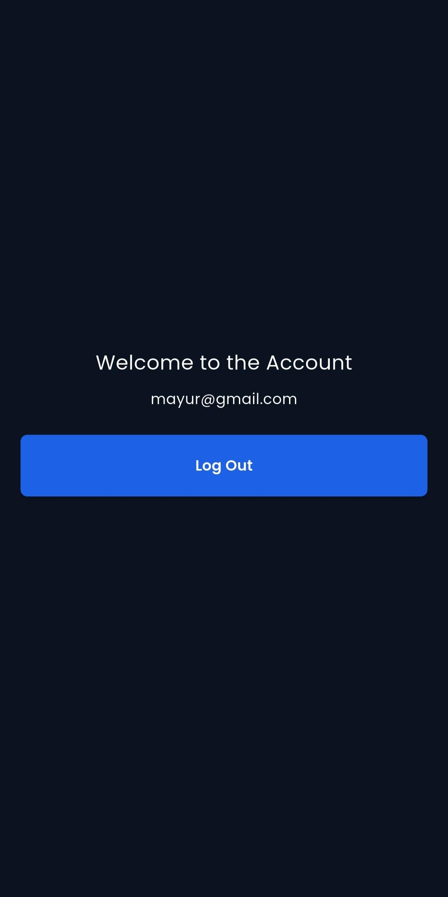
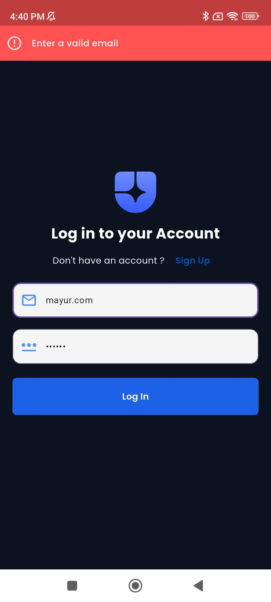
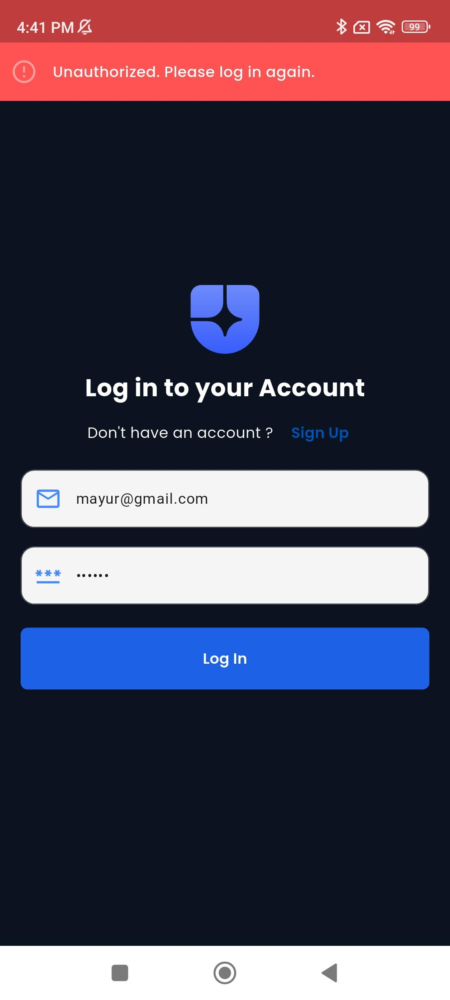
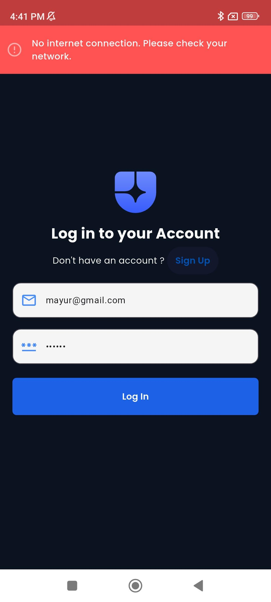
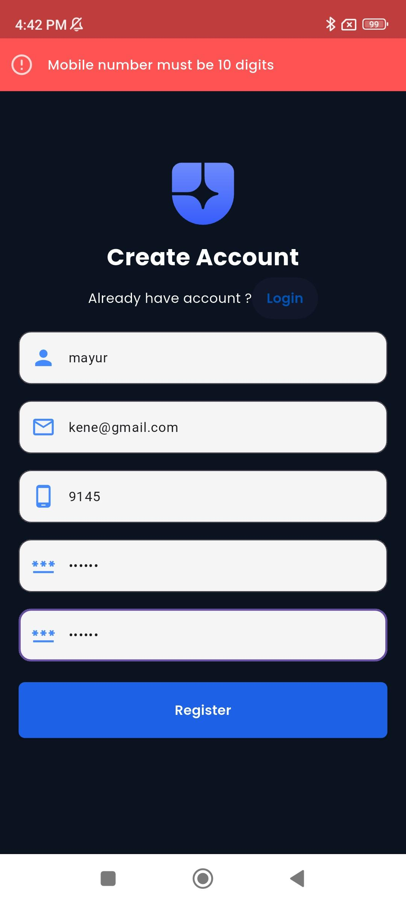
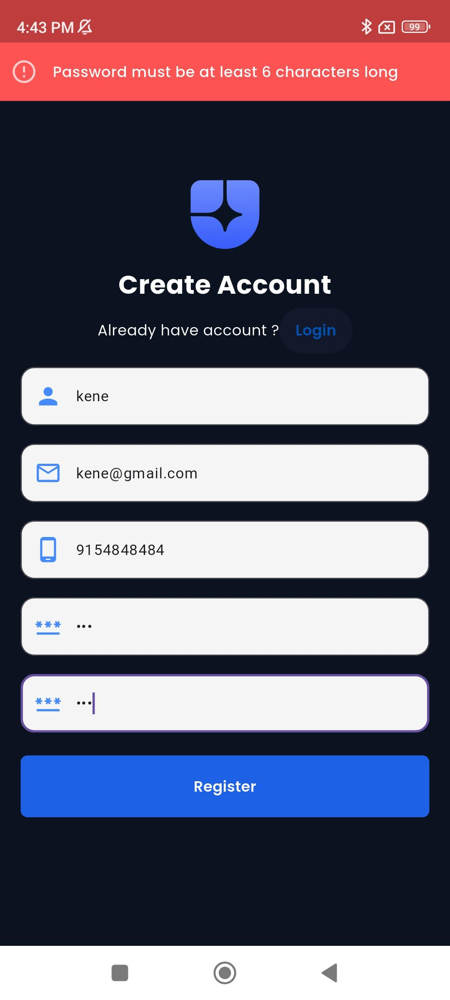
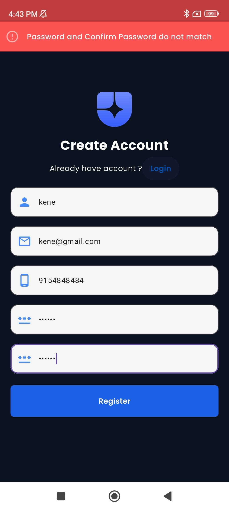

# Evergreenix Flutter Task

A simple Flutter project created as a task for **Evergreenix**, allowing users to **log in** and *
*sign up**. This project demonstrates the use of state management, API calls, and local storage in
Flutter.

---

## 🎨 Design Reference

The UI for this project was designed based on **Figma Login Version 6**. You can view the reference
design here:  
[Figma Login Version 6](<https://www.figma.com/design/a9grXsVpGfxgFDTVvZ5AXt/20-Screen-Login---Register-Mobile-App--Community-?node-id=2-2&t=6yxGmNoaoZor3xHK-0>)

---

## 🛠 Project Details

- **Flutter Version:** 3.27.0 (Stable)
- **Dart Version:** 3.6.0

---

## 📦 Libraries Used

| Library                | Version | Use Case                                                                                                                                  |
|------------------------|---------|-------------------------------------------------------------------------------------------------------------------------------------------|
| `get: ^4.7.2`          | 4.7.2   | For state management, dependency injection, and routing. Makes managing app state and navigation simple and reactive.                     |
| `google_fonts: ^6.2.1` | 6.2.1   | To easily use Google Fonts in the app for better typography and design customization.                                                     |
| `flutter_svg: ^2.0.17` | 2.0.17  | To render SVG images in the app, ensuring crisp graphics on all screen sizes.                                                             |
| `dio: ^5.9.0`          | 5.9.0   | For performing HTTP requests (GET, POST, etc.) to communicate with APIs.                                                                  |
| `get_storage: ^2.1.1`  | 2.1.1   | For lightweight local storage to persist user login data and app settings.                                                                |
| `animate_do: ^4.2.0`   | 4.2.0   | Provides prebuilt, easy-to-use animations (fade, bounce, zoom, etc.) to enhance UI/UX. Used for splash screen animations in this project. |

---

## 🚀 Features

- **User Authentication**
    - **Sign Up:** Allows new users to register with email and password.
    - **Login:** Allows existing users to log in and access the app.
- **State Management:** Uses GetX to manage the app's state and routing efficiently.
- **API Integration:** Communicates with backend APIs for login and signup functionality.
- **Local Storage:** Stores user information locally for persistent login using GetStorage.
- **Responsive UI:** Supports multiple screen sizes and renders SVG graphics using `flutter_svg`.
- **Custom Fonts:** Uses `google_fonts` for modern and clean typography.

-------------------------------------------

## 🖼 Screenshots

### 1️⃣ App Screens

| Screen        | Preview                                                 |
|---------------|---------------------------------------------------------|
| Splash Screen |  |
| Login Screen  |    |
| Signup Screen |  |
| Home Screen   |      |

### 2️⃣ Validation Screens

| Validation Type         | Preview                                                                     |
|-------------------------|-----------------------------------------------------------------------------|
| Email Validation        |          |
| Unauthorize Status Code |   |
| No Internet Handling    |      |
| Phone Number Validation |             |
| Pass Length Validation  |    |
| Confirm Pass Validation |  |

---

Follow these steps to **clone and set up the project locally**:

1. ## Clone the repository

git clone <repository_url>

2. ## Navigate to the project directory

cd <project_name>

3. ## Install Flutter dependencies

flutter pub get

4. ## Check Flutter & Dart versions

flutter --version

`Ensure Flutter version: 3.27.0`
`Ensure Dart version: 3.6.0`

5. ## Run the project

flutter run

